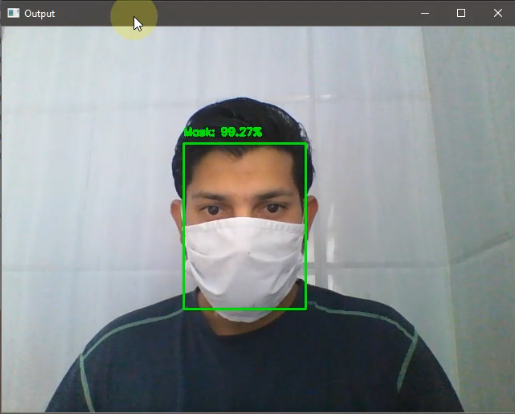

<h1><b>Live face mask detection</b></h1>

<h3>Easiest Way for live face mask detection</h3>
<h4>You have to install python and some library Using : <b>pip install library_name</b></h4>
<ol>
  <li><b>tensorflow</b></li>
  <li><b>numpy</b></li>
  <li><b>argparse</b></li>
  <li><b>Open cv</b></li>
</ol>
<h4>Now download and run maskdetecting.py using : <b>python maskdetecting.py</b></h4>
<h3>Please wait for 15-20 seconds it will take time to get you camera access</b></h3>

